# Lab 1 - Enable Fabric Copilot for Power BI to use it for Power BI service and Power BI Desktop

**Objective** - In this lab, you will enable the trial Fabric license and create a Fabric capacity which you will be using to execute the further labs. You will also know to use Copilot in Power BI service and desktop

## Task 1 - Enable Fabric Trial License

1.  Open a browser and paste the Fabric
    Trial URL - <https://www.microsoft.com/en-us/microsoft-fabric/getting-started>
    and Login with the credentials provided to you to execute the lab.

2.  Click on **Try for Free.**

    

3.  Enter your credentials.

    

4.  Once you enter your credentials and selected Next. You will be
    navigated to Microsoft Fabric Home page.

    

5.  You must make sure that the Trial licence is enabled by selecting
    the account on top-right corner of the Fabric home page. Select
    **Free Trial.**

    

6.  Select **Free Trial.**

    

7.  Once it is enabled, select **Fabric Home Page.** You will be
    navigated to Fabric Home Page.

    

    

## Task 2 - Create Fabric Capacity using Azure portal

Microsoft Fabric is deployed to an Azure Active Directory tenant. Within
each Fabric tenant, Fabric capacities can be created to group resources
for various purposes -- this might be done organizationally (sales,
marketing, development), geographically, or other logical grouping.

If a Fabric Trial is available, we recommend taking advantage of that
opportunity to try Microsoft Fabric for a period of time (currently 60
days) with no commitment. To see if you are in a trial or eligible for a
trial, visit the [Fabric portal](https://app.fabric.microsoft.com/). If
you are able to log in or presented the option to start a trial, you
should be all set!

To create a Fabric capacity outside of a trial environment, create a new
resource from the Azure portal, and search for Fabric.

1.  Open a new tab in the browser. Login to Azure Portal – <https://portal.azure.com> with the
    credentials provided to you to execute the lab.

2.  From the Azure portal home page, click on **Azure portal menu**
    represented by three horizontal bars on the left side of the
    Microsoft Azure command bar as shown in the below image.

    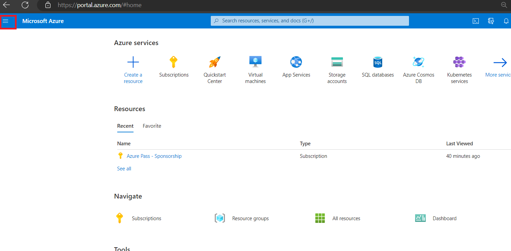

3.  Navigate and click on **+ Create a resource**.

    

4.  On **Create a resource** page, in the **Search services and
    marketplace** search bar, type!!**Fabric!!**, then select
    **Microsoft fabric**.

    

5.  In the **Marketplace** page, navigate to the **Microsoft Fabric**
    section, click on the **Create** button dropdown, then select
    **Microsoft Fabric** as shown in the image.

    

6.  In the **Create Fabric capacity** window, under the **Basics** tab,
    enter the following details and click on the **Review+create**
    button.

    1. **Subscription** - Select the assigned subscription

    2. **Resource group**	Click on **Create new** enter ``FabricXXX`` (XXX can be a unique number, you can add more digits after XXX to make the name unique)

    3. **Capacity name** - !!fabricXXX!!( XXX can be a unique number, you can add more digits after XXX to make the name unique)

    4. **Region** - Select near by available region, in this lab **West US 3** is using for this resource

    5. **Size**	 -  F64 SKU 

        

    

7.  Once the Validation is succeeded, click on the **Create** button.

    

8.  After the deployment is completed, click on the **Go to resource**
    button.

    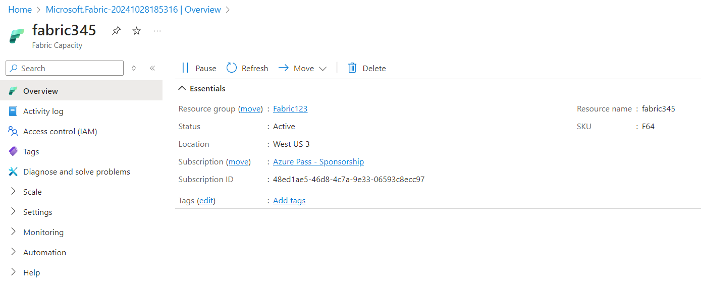

## Task 3 - Using Copilot for Power BI in the service

To use Copilot in the Power BI service, you need to ensure that reports
are in a workspace at the right capacity. The workspace must be in
either Premium Power BI (P1 and above) or paid Fabric (F64 and
above) capacity.

### Step 1 - Create a Fabric Workspace

1.  Switch back to Fabric Home page.

2.  Go back to **Power BI** window. Select Power BI from the left bottom
    navigation pane.

    

3.  On the left side navigation menu of **Power BI** Home page, navigate
    and click on **Workspaces**.

    

4.  In the Workspaces pane, click on **+** **New workspace button.**

> 

5.  In the **Create a workspace** pane that appears on the right side,
    enter the following details, and click on the **Apply** button.

    1. **Name** - `Fabric WSXXX` (XXX can be a unique number) 

    2. **Advanced**	- Under **License mode**, select **Fabric** 

    3. **Default storage format** - Small semantic dataset storage format

    4. **Capacity** - FabricXXX-West US3

    5. **Template apps**	 -  Check the Develop template apps

    

    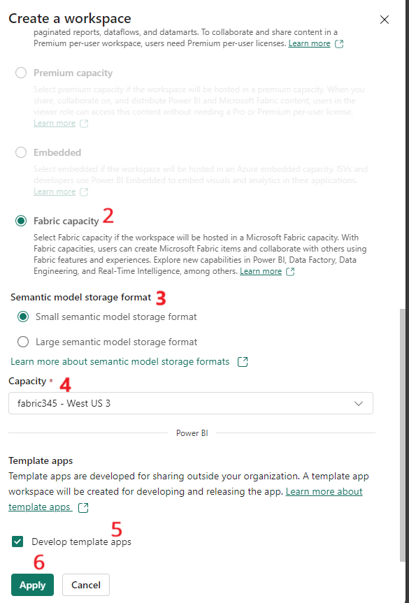

6.  Wait for the deployment to complete. It takes 2-3 minutes to
    complete.

    

7.  Select **Workspace settings.**

    

8.  Select **License info** and check that workspace is created under
    **Fabric Capacity**

    

## Task 4 - Using Copilot in Power BI Desktop

1.  Launch the Power BI application from the desktop in the VM

2.  Sign in with the credentials that is provided to execute the lab

3.  Once you are logged in, select **Copilot.**

    

4.  Enter the credentials provided to you to execute the lab.

5.  Once you are logged in, you can access apps and services.

    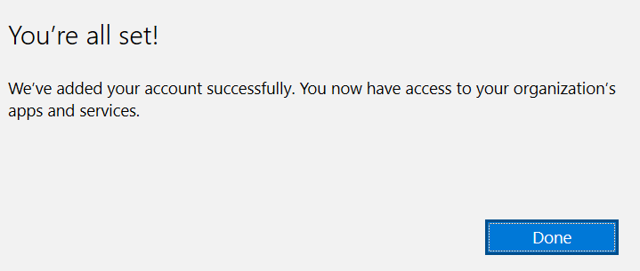

6.  Select **Select Workspace.**

7.  Click on drop-down to select your workspace that you created.

    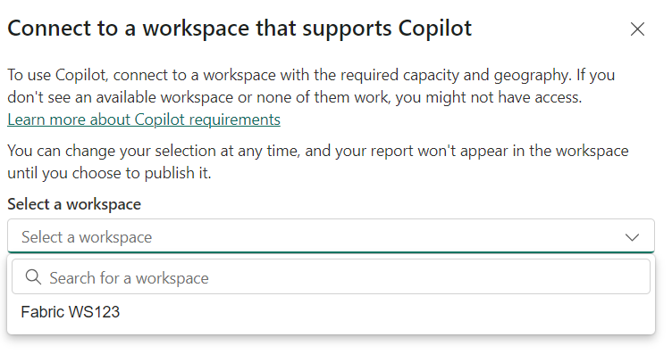

8.  Select **OK**

    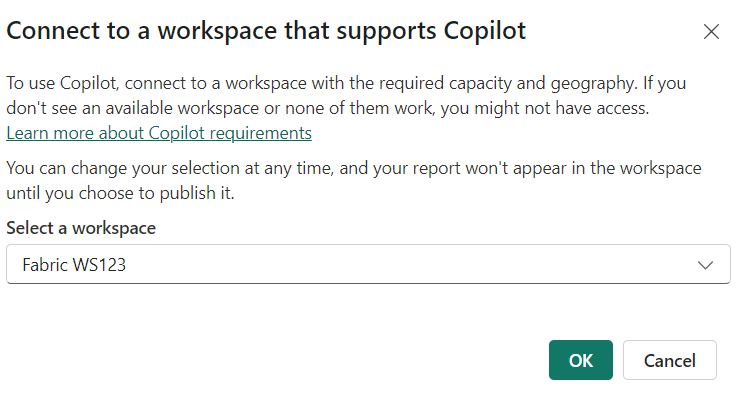

9.  Select **Get Started**

    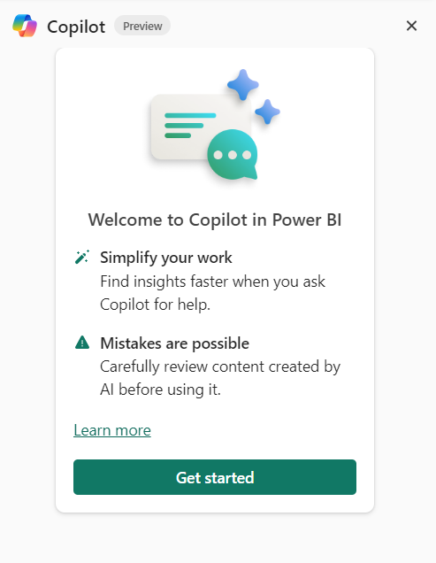

    

## Task 5 - Import Files to Lakehouse in Fabric

1.	Navigate back to Power BI Service in Microsoft Fabric Portal. Select your workspace.

2.	Select New Item

    
 
3.	Search for Lakehouse and select the correct option from the list under Store data

    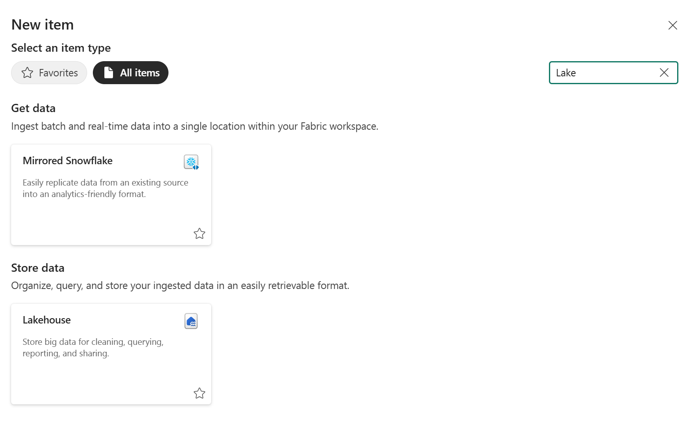
 
4.	Enter the name of the Lakhouse as – PowerBIFiles. Select Create

    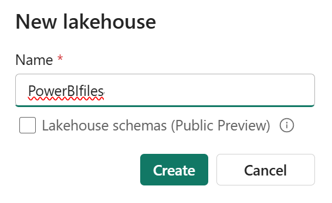
 
5.	Expand Get data > Upload files

    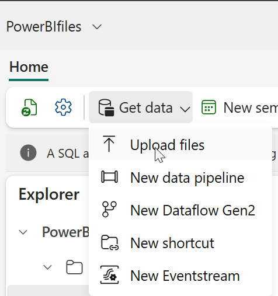
 
6.	Select Browse icon. 

    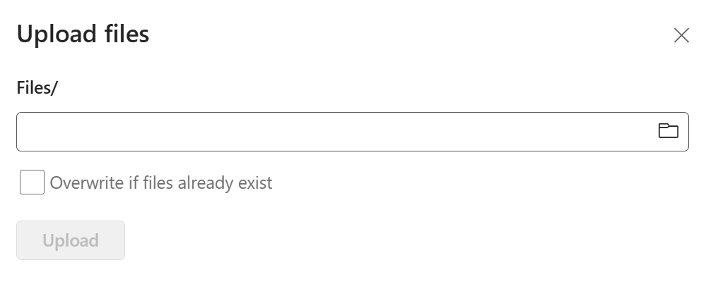
 
7.	Navigate to C:\Labfiles. Select the below CSV files and select upload

    1.	Vendors List.csv
    
    2.	Churn.csv

    3.	Sales.csv

    4.	Orders.csv

    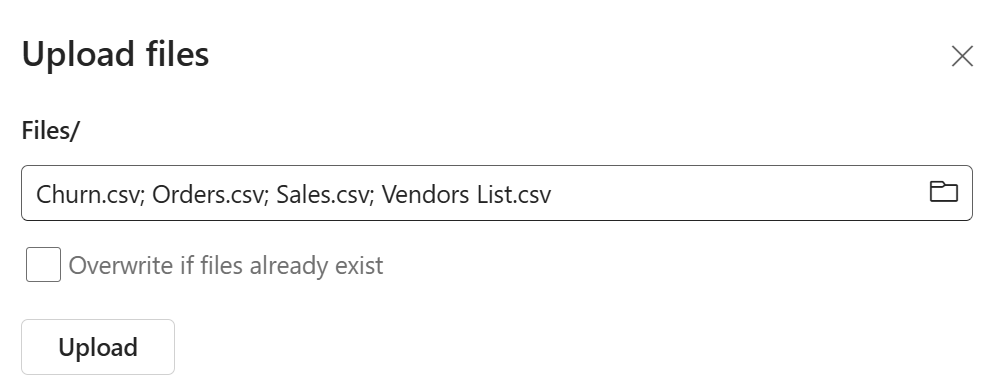
 
8.	Close the window once all the files are uploaded.

    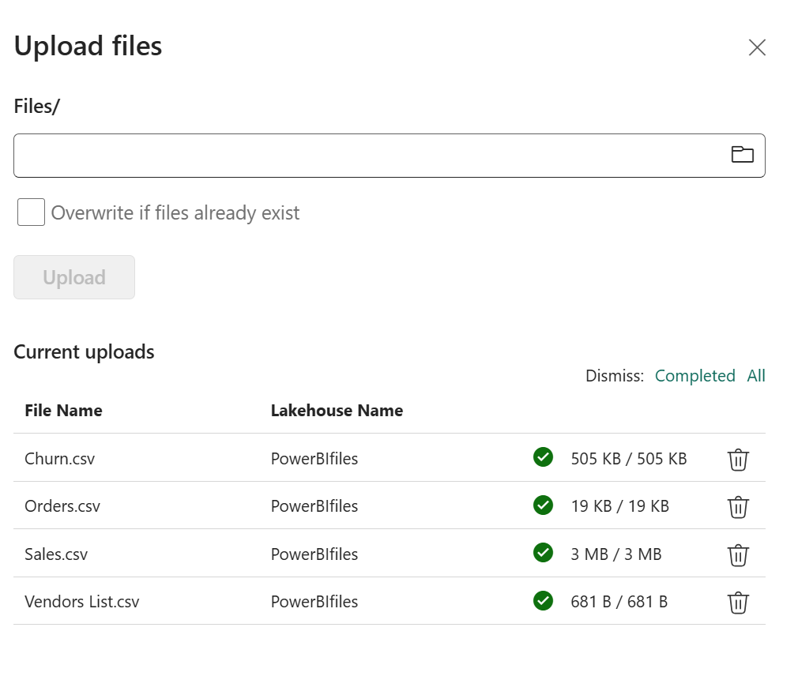
 
9.	Refresh the Lakehouse page for the files to visible.

    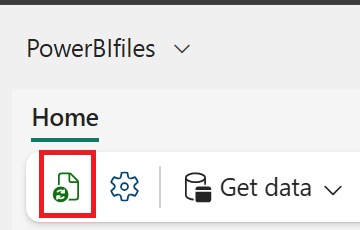
 
10.	The files are visible for future labs.

    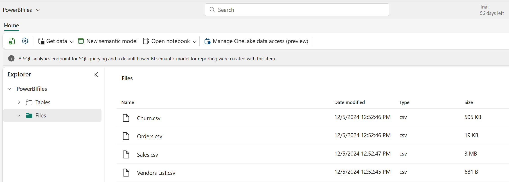
 
11.	Select three horizontal dots for a file – Vendor List. Select Load to Tables> New Table
 
    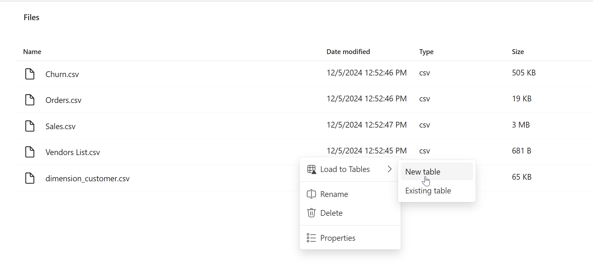

12.	 Give a proper name for the table and select Load.

     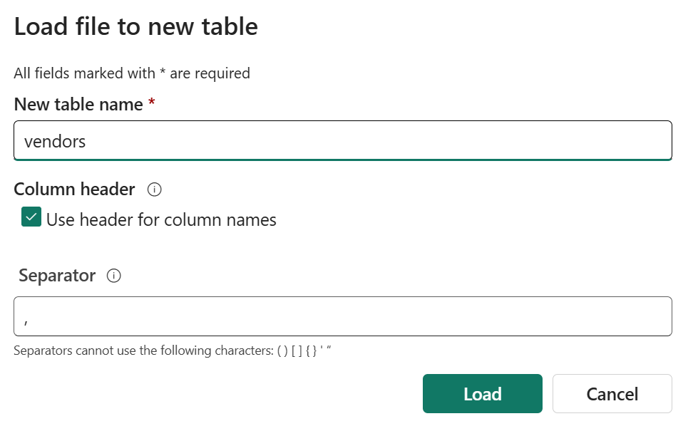
 
13.	It will take some time to load.

    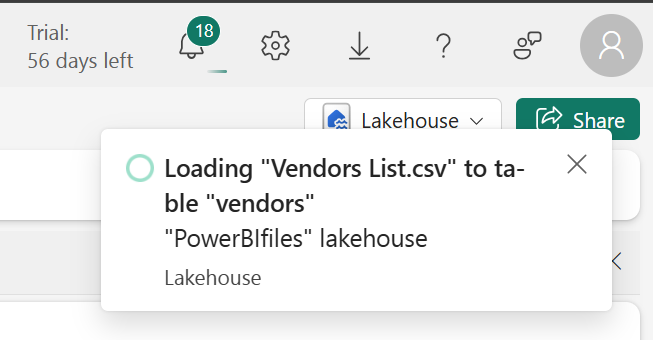
 
    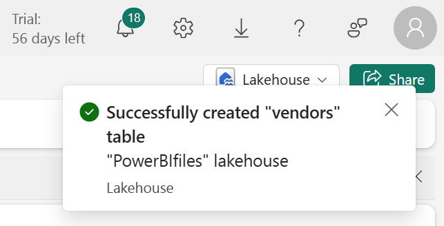
 
14.	 You will see the table is created.

     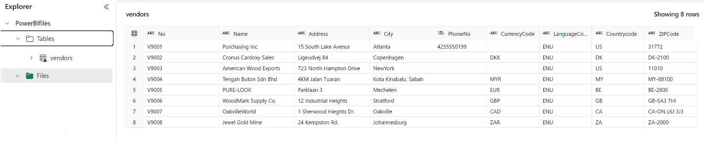
 
15.	Perform the same steps for the other three tables.

**Summary** - Congratulations !! You have successfully enabled the license and created the Fabric Capacity to use Copilot in Power BI service and desktop