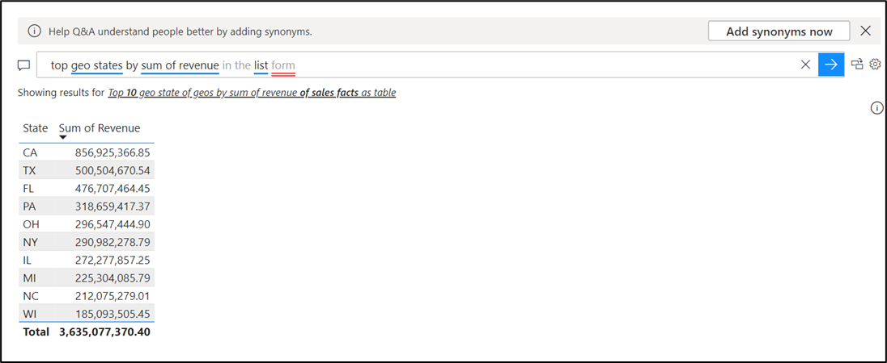

# Using natural language to enhance Q&A with Copilot for Power BI

## Exercise 1 - Use Power BI Q&A to explore your data and create visuals on a dashboard

### Task 1 – Import a Sales and Marketing Sample file.

1.  Launch the **Power BI Desktop** app on the Desktop

2.  Sign in if you are not signed in with the credentials provided you
    to execute the lab

3.  Select **Open**

4.  Select **Browse this device and** navigate to **C:\LabFiles.**
    Select **Sales and Marketing Sample.pbix** file.

5.  The Power BI file will launch.

6.  Open a new page by selecting **+**(plus).

7.  Start on a blank report page and select the **Q&A visual** icon on
    the **Visualizations** \> **Build visual** pane.

8.  The Q&A window is visible.

9.  To customize your visual, select a suggested question or enter text
    in the Q&A question field, where it says *Ask a question about your
    data –* Enter - **top geo states by sum of revenue**.

Power BI determines the appropriate visual type based on the selected
suggestion or entered text. In our example, Power BI determines that a
map visual is best suited to display the data.

10. You can also instruct Power BI to use a specific visual type by
    adding the type to the text you enter in the **Q&A question field**.
    For example, the data in our example isn't meaningful when presented
    on a scatter chart, but it's helpful when shown as a filled map.

11. Enter - **top geo states by sum of revenue** **filled map**

### Task 2 - Create a Q&A visual with a natural language query

1.  As you enter text, Power BI adds a red double underline to words it
    doesn't recognize. When possible, Power BI helps define unrecognized
    words. – **Enter revenue for VanA**

2.  The following example shows suggestions from Power BI for an
    unrecognized term. The two suggestions can satisfy our intended
    question.

3.  Let's choose the last suggestion in the list. Enter more text for
    the current question. Enter - **Total sum of revenue for Vanarsdel
    (product manufacturer)**. As you enter more text for the question,
    Power BI lets you know when it doesn't understand the question and
    tries to help. In this example, Power BI suggests a different way to
    word the question by using terminology from the semantic model. The
    suggested terms are underlined in blue.

4.  With Power BI's help, we're able to ask a question with all
    recognizable terms. Power BI displays the results accordingly.

5.  Instruct the Q&A visual to show the data in columns by adjusting
    your question. At the end of your current query, enter the text "as
    a column chart."

### Task 3 - Enhancing Q&A with Copilot for Power BI

1.  One a new page in the report, in the Q&A window. Enter – **Show
    available manufacturers by region** and run the query.

2.  The available word is not identified. Hence, we can assign synonym
    to **available manufacturers** to **Manufacturers**

3.  Select the gear icon on the Q&A window.

4.  Select **Synonyms**.

5.  Expand **Manufacturers.**

6.  **Add available manufacturers for manufacturers (First one).**

7.  Now it recognises the word

8.  If we want to refer to a name with other name, we can teach Q&A. If
    we want to teach **Region** as **Location**. Select the gear icon.

9.  Select **Region** an alternative for **Location** and select
    **Save**

10. The result is displayed

