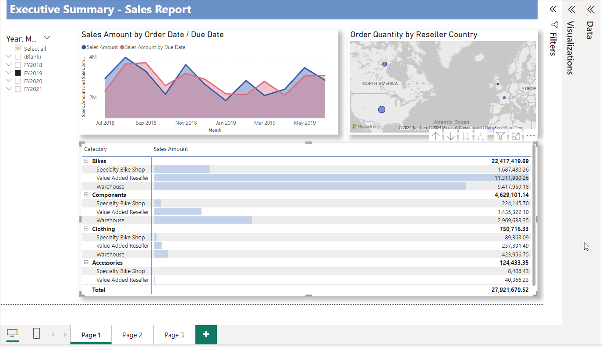
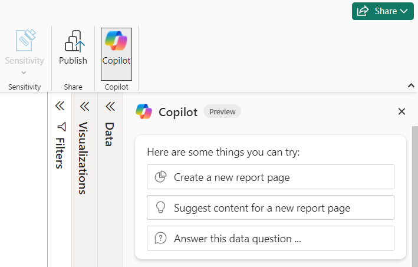
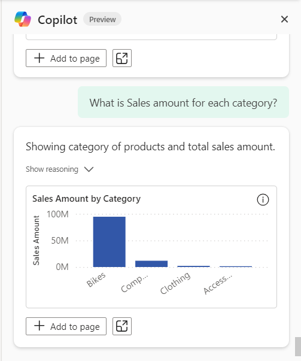
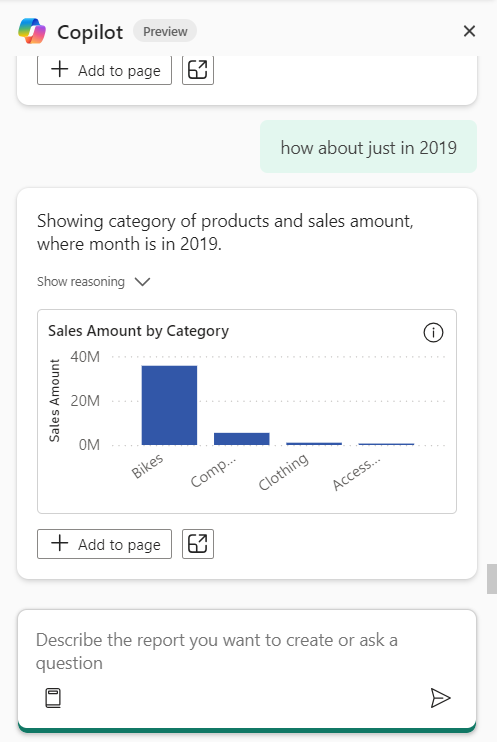
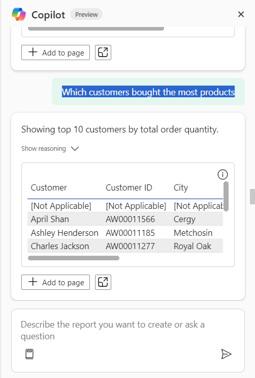

# Lab 11 - Ask Copilot for data from your model

**Objective** - In this Lab, you will learn about querying Copilot with questions regarding your model and checking your answers

## Task 1 – Import a PBIX file in Power BI Desktop

1.  Launch the **Power BI Desktop** app on the Desktop

2.  Sign in if you are not signed in with the credentials provided you
    to execute the lab

3.  Select **Open**

    

4.  Select **Browse this device** and navigate to **C:\LabFiles.**
    Select **AdventureWorks Sales.pbix** file.

5.  The file is loaded.

    

6.  Select Copilot from the ribbon to launch the Copilot pane.

    

## Task 2 – Asking Copilot questions for data from your model

The exact questions that Copilot can answer depends on the specifics of
your model. Questions may include asking for existing measures filtered
to a different region or span of time than they are on the report, a
metric split into categories, or how a measure changes with time.

1.  Enter - **Can you show me sales amount by region.** The Sales amount
    and region are already columns in the data. The data is generated.

    

2.  Enter - **What were the top 5 selling products in Canada?** where
    product, region are already columns in the data, and Copilot helps
    with top N filtering to produce the visual.

    

3.  Enter – **Tell me the average price of bikes in 2020** – Where the
    Copilot responds providing you the information from the model.

    

4.  Enter – **What is the sales amount for each category –** This helps
    us to know the amount for each category as per the data model that
    we are using.

    

5.  You can make it conversational and use natural language asking about
    a specific year. Enter – **How about just in 2019**

    

6.  To know the customer details, you can enter – **Which customers
    bought the most products.**

7.  You will receive a tabular format of the details of the customers.

    

**Note –** Accordingly you can analyse the data and ask copilot the
questions to retrieve the answers about the model. You can filter by
year to know the details.

**Summary** - Congratulations!! You have successfully learnt about querying Copilot with questions regarding your model and checking your answers
