# Lab 12 - Work with chat-magics and Data Engineering chat panel in Microsoft Fabric notebooks

**Objective** - In this Lab, You will learn about Data Engineering module in Microsoft Fabric. 
You will learn about how to work  with chat-magics and Data Engineering chat panel in Microsoft Fabric notebooks

## Task 1 - Create a new Fabric Workspace

1.  Switch back to Fabric Home page -
    <https://app.fabric.microsoft.com/home>

2.  Login with the credentials if you receive a pop-up.

3.  Select **Data Engineering** once you click on **Microsoft Fabric**
    on bottom-left of the home page.

    

4.  Update the below details

    1.  Name – **Lakehouse**

    2.  Expand **Advanced \> License mode \>** Select **Fabric
        capacity**

    3.  Semantic model storage format – Select **Small semantic model
        storage format**

    4.  Capacity – Select the capacity you created

    5.  Check the option – **Develop template apps**

    6.  Select **Apply**

    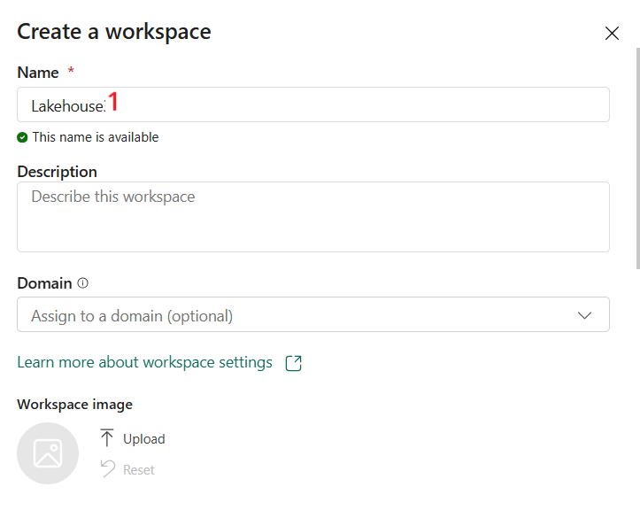

    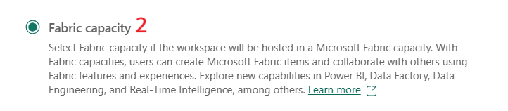

    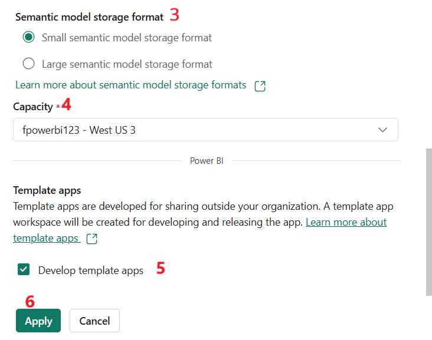

## Task 2 - Create a Lakehouse

1.  Select **Data Engineering** from the bottom left of the home page
    again.

2.  Select **Lakehouse**

    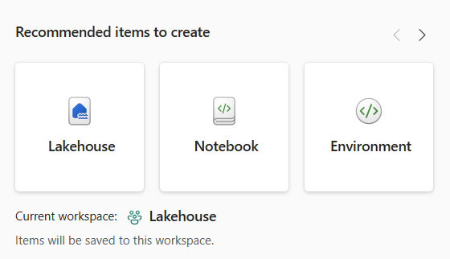

3.  Enter the name as **FabricLakehouse** and select **Create**.

    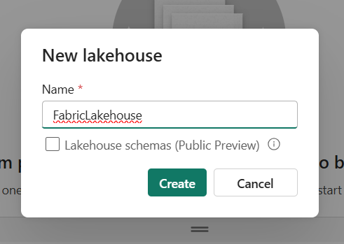

## Task 3 - Ingest sample data

1.  Select **Get data \> New Dataflow Gen 2**

    

2.  Select **Import from Text/CSV file**

    

3.  On the **Connect to data source** pane, select the **Upload
    file** radio button. Click on the **Browse button** and browse to
    **C:\LabFiles** on your VM, then select
    **dimension_customer.csv** file and click on **Open** button.

    

4.  Select **Next**

    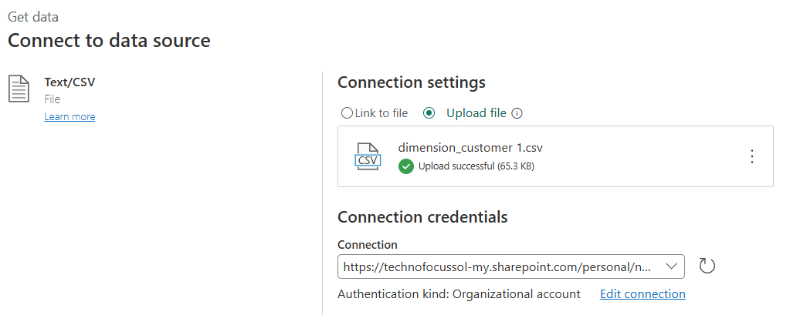

5.  In the **Preview file data** page, go through the data and click on
    the **Create** button. You’ll be directed to **Dataflow** canvas.

    

6.  In the **Query settings** pane on the right side of the Dataflow
    canvas, ensure that **dimension_customer** is selected under the
    **Name** field. Similarly, ensure that **Lakehouse** is selected
    under the **Data destination** field.

    

7.  From the Dataflow canvas, you can easily transform the data based on
    your business requirements. For simplicity, we aren't making any
    changes in this task. To proceed, select **Publish** at the bottom
    right of the screen. Select **Publish now**

8.  A spinning circle next to the dataflow's name indicates publishing
    is in progress in the item view.

    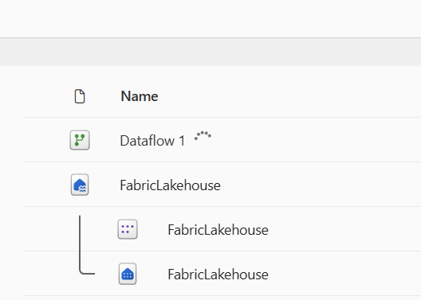

9.  When publishing is completed, move your mouse to **Dataflow 1** row
    and click on the horizontal ellipses (**…)**, then navigate and
    click on **Properties** as shown in the below image.

    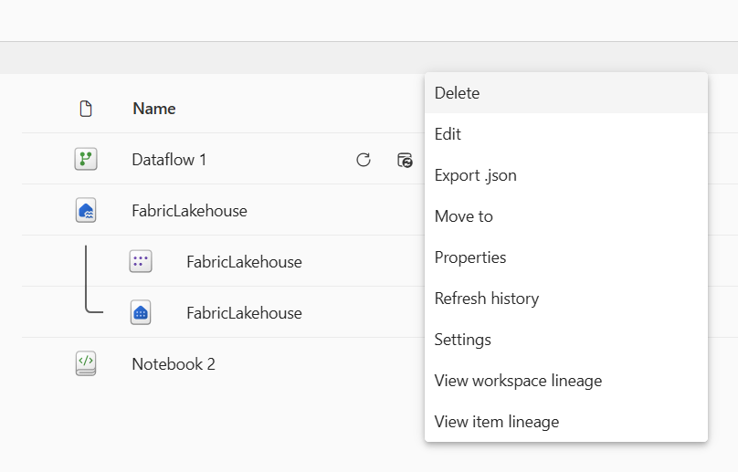

10. In the Dataflow 1 pane that appear on the right side, rename the
    dataflow to  **Load Lakehouse Table**  and select **Save**.

    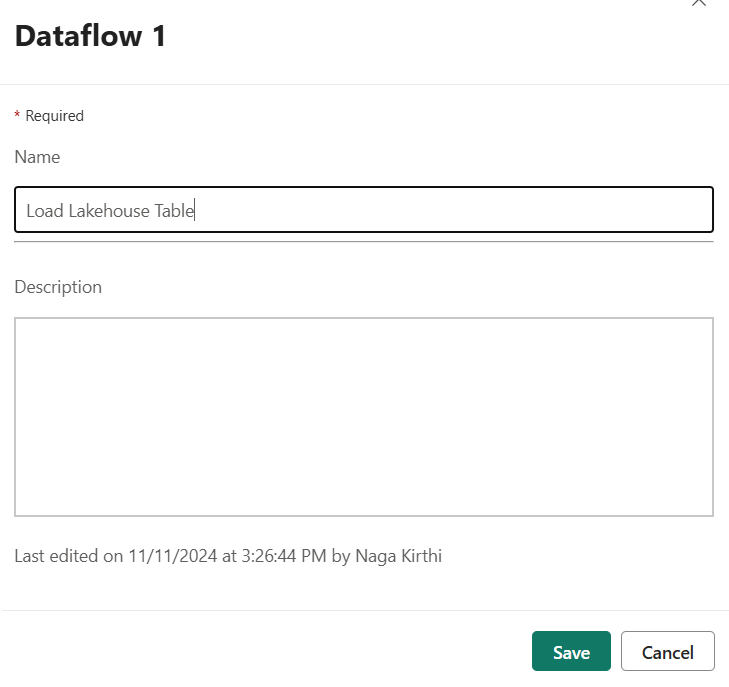

11. Select the **Refresh now** option next to data flow name to refresh
    the dataflow. It runs the dataflow and moves data from the source
    file to lakehouse table. While it's in progress, you see a spinning
    circle under **Refreshed** column in the item view.

12. When you open the Lakehouse, the data is displayed

    

## Task 4 - Create a new notebook

1.  Select Data Engineering again from the bottom left of the home page.

2.  Select **Notebook**

    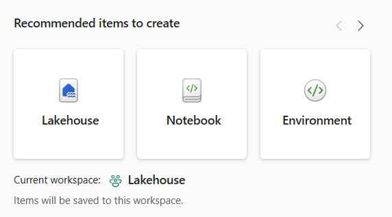

3.  You can rename the notebook by selecting the name on Top left corner
    of the notebook page.

    

4.  Select Lakehouse on the left navigation pane.

    

5.  Select **Add.**

    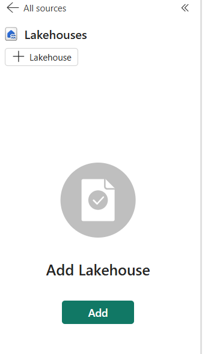

6.  Select **Existing Lakehouse without schema**

    

7.  Select **FabricLakehouse** we just created. Select **Add.**

    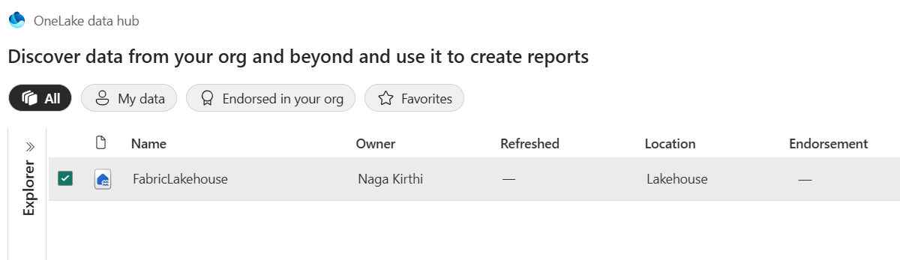

## Task 5 – Enabling Chat magic and verifying its installation

1.  Select the **Copilot** button on the notebook ribbon. Select **Get
    Started**

2.  Once this is done, it outputs the Chat-magics initialization code
    into a new notebook cell. Run the cell when it is added at the top
    of your notebook.

    

3.  It takes approximately 2-3 minutes to run and complete. Once it is
    completed, it gives all the details about the commands.

    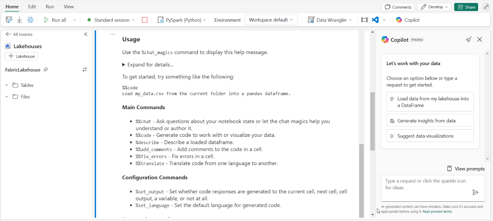

Note - Since this is in preview mode, not all the commands will be downloaded. once this is generally available, the commands will be downloaded.

**Summary** - Congratulations!! You have successfully learnt about Data Engineering module in Microsoft Fabric. 
You will learn about how to work  with chat-magics and Data Engineering chat panel in Microsoft Fabric notebooks
