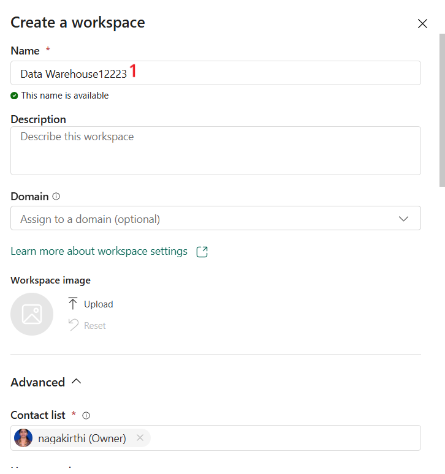
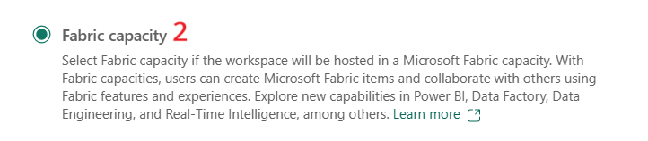
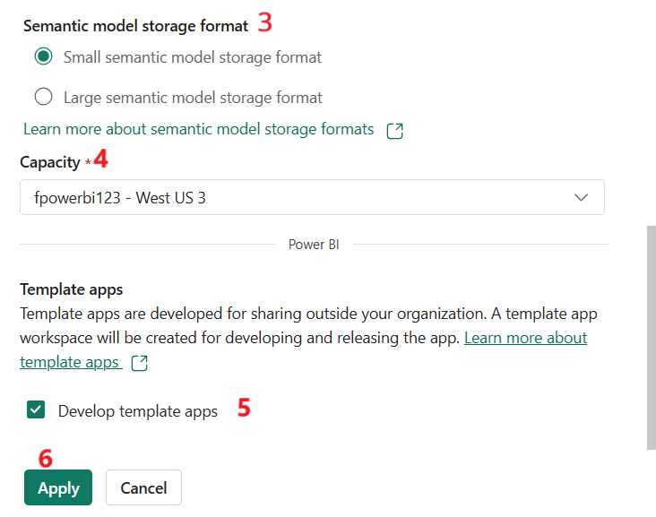
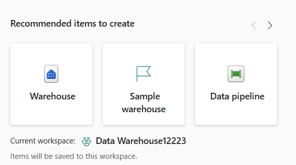
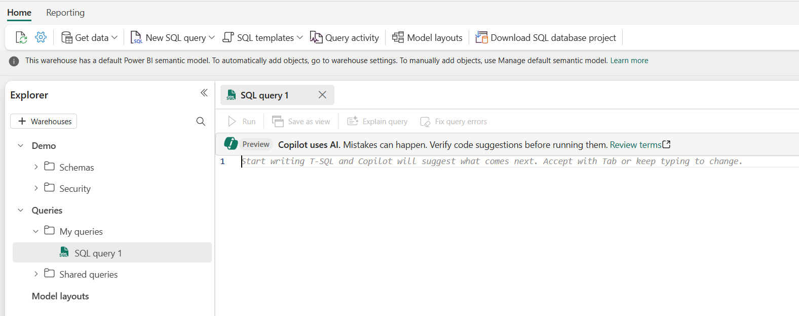
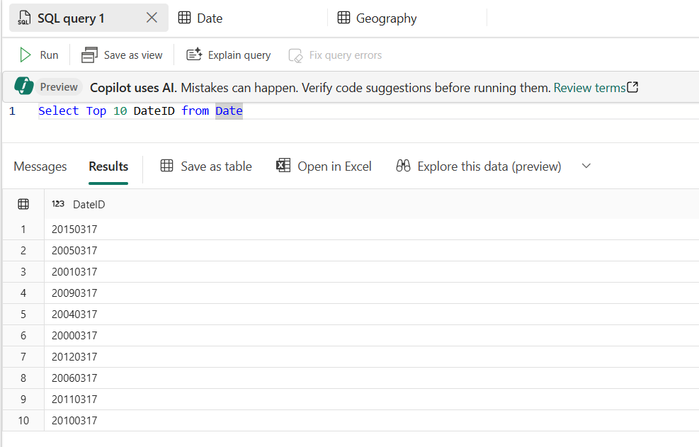
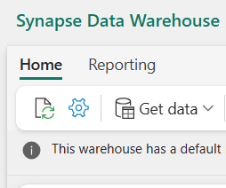
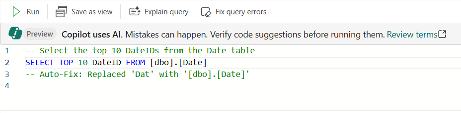

# Use the Copilot chat pane, code completion and quick actions for Synapse Data Warehouse

## Task 1 - Create a new Fabric Workspace

1.  Switch back to Fabric Home page -
    <https://app.fabric.microsoft.com/home>

2.  Login with the credentials if you receive a pop-up.

3.  Select **Data Warehouse** once you click on **Microsoft Fabric** on
    bottom-left of the home page.

4.  Update the below details

    1.  Name – **DatawarehouseXXXX** (you can address XXX to a unique
        number your choice)

    2.  Expand **Advanced \> License mode \>** Select **Fabric
        capacity**

    3.  Semantic model storage format – Select **Small semantic model
        storage format**

    4.  Capacity – Select the capacity you created

    5.  Check the option – **Develop template apps**

    6.  Select **Apply**

## Task 2 - Create a Sample Warehouse 

1.  Select **Data Engineering** from the bottom left of the home page
    again.

2.  Select **Sample Warehouse.**

3.  Enter the name as **Demo** and select **Create**. The warehouse is
    created with Sample values and parameters.

4.  Select **New SQL Query**

## Task 3 - Use the Copilot for Synapse Data Warehouse

1.  Enter **Select Top 10 DateID from Date.** This is the query for one
    table named **Date**

2.  Copilot responds accordingly and the result is displayed.

## Task 4 - Use Copilot code completion for Synapse Data Warehouse

Verify the **Show Copilot completions** setting enabled in your
warehouse settings.

1.  You can also check the setting's status through the status bar at
    the bottom of the query editor. 

2.  If not enabled, then in your warehouse **Settings**, select
    the **Copilot** pane. Enable the **Show Copilot completions** option
    is enabled.

## Task 5 - Using Quick Actions

1.  Highlight the query that you want Copilot to explain. You can select
    the whole query or just a part of it.

2.  Select the **Explain** **query** button in the toolbar. Copilot will
    analyze your query and generate inline comments that explain what
    your code does. If applicable, Copilot will leave a summary at the
    top of the query as well. The comments will appear next to the
    relevant lines of code in your query editor.

3.  Review the comments that Copilot generated. You can edit or delete
    them if you want. You can also undo the changes if you don't like
    them, or make further edits.

## Task 6 - Fixing errors

1.  From the query remove the letter **“e”** from the table name
    **Date.**

2.  Run the query and you will receive an error message as shown in the
    screenshot below

3.  Select **Fix query errors**

4.  Copilot analyses your query and will try to find the best way to fix
    it. It will also add comments to explain what it fixed and why.

5.  Review the changes that Copilot made and select **Run** to execute
    the fixed query. You can also undo the changes if you don't like
    them, or make further edits.

> 
