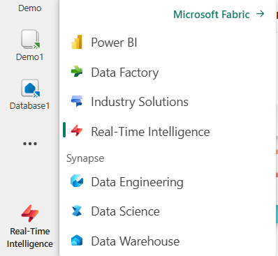
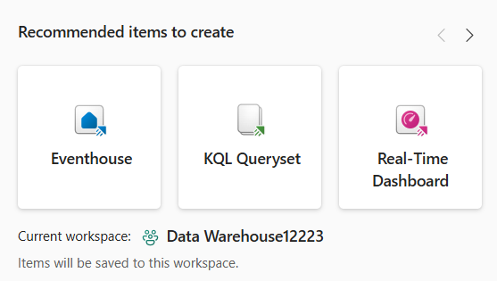
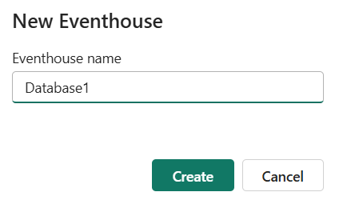
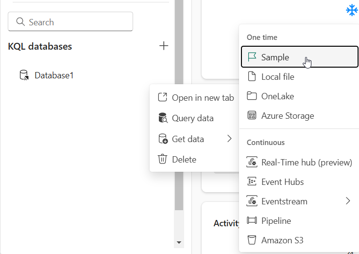
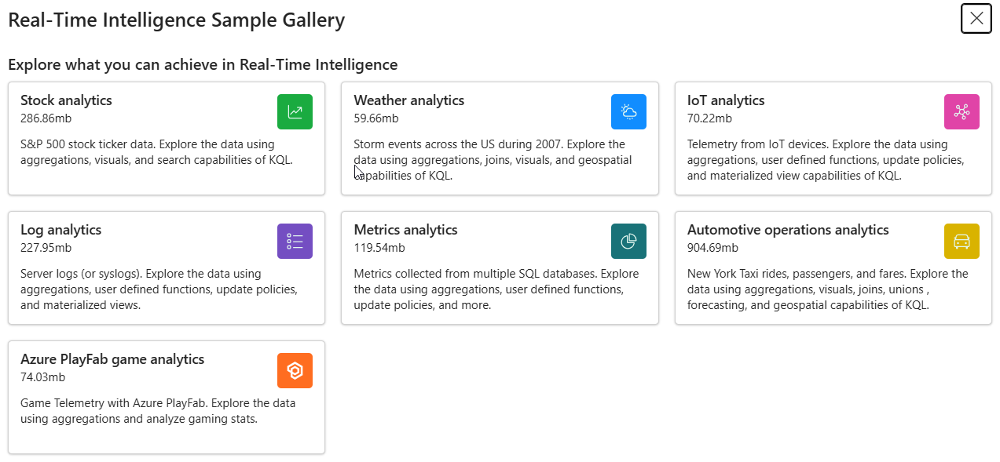
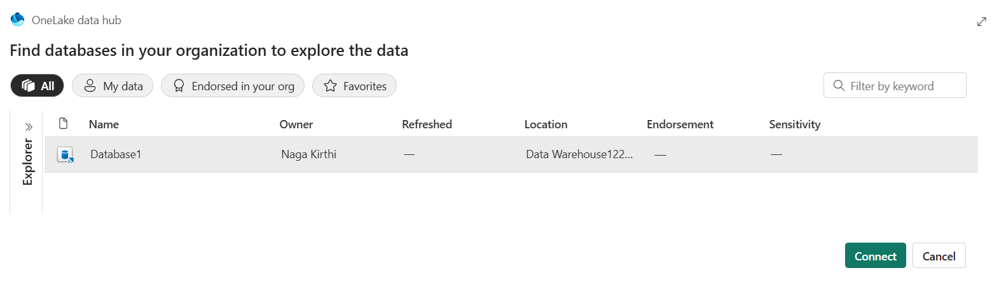

# Access the Real-Time Intelligence Copilot and improve the accuracy 

**Objective** - In this Lab, You will learn about using Real-Time Intelligence Copilot and improve the accuracy 

## Task 1 - Create KQL Database

1.  On the Fabric Home page. <https://app.fabric.microsoft.com>. Login
    with the credentials if you have not logged in.

2.  Select **Real-Time Intelligence** from the Bottom left corner of the
    Microsoft Fabric Home page.

3.  Select **EventHouse** under **Recommended items to create**

**Note** – Make sure you are creating under a fabric capacity workspace.

4.  Enter the database name as – Database 1

5.  Select three horizontal dots beside the database name. Select **Get
    Data \> Sample.**

6.  Select **Stock Analysis.**

7.  The table is loaded

## Task 2 - Create a KQL Query Set

1.  Select **Real-Time Intelligence** and Select **KQL QuerySet**

2.  Enter **Demo** as the name of the Query set and select **Create**

3.  Select the **Database 1** that you created in the previous task and
    select **Connect**

4.  The Queryset is loaded

## Task 3 - Access the Real-Time Intelligence Copilot

1.  Select the **Copilot** button.

2.  In the Copilot pane, enter your business question in natural
    language. - **List of top 10 rows of stocks table**

3.  Press **Enter**. After a few seconds, Copilot will generate a KQL
    query based on your input. 

4.  You can copy the query to the clipboard, or **Insert** it directly
    in the KQL query editor. To run the query in the query editor, you
    must have write access to the KQL queryset. Select
    the **Run** button to execute the query.

5.  The Query runs successfully.

**Summary** - Congratulations!! You have successfully learnt to access the Real-Time Intelligence Copilot and improve the accuracy 