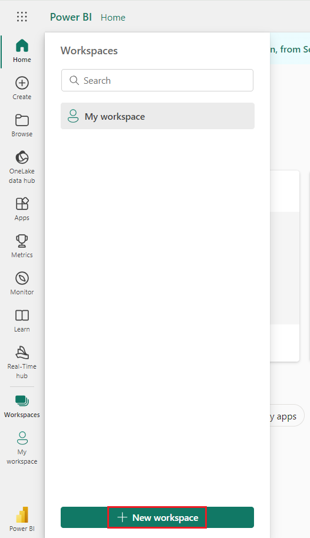
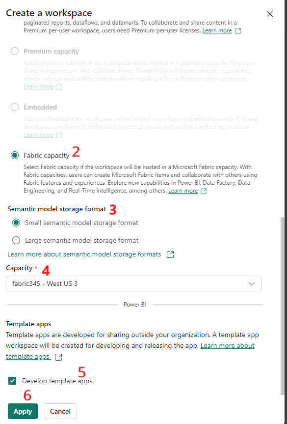

# Create reports in the Power BI service and Power BI Desktop with Copilot 

## Exercise 1 - Creating reports in the Power BI service with Copilot

### Task 1 - Generate report using Copilot in Power BI Service

1.  Switch to Power BI Fabric Portal -
    \`https://app.fabric.microsoft.com/home?experience=power-bi\` with
    the credentials provided to you

2.  Select the workspace that you created.

3.  Select **New item.**

4.  Enter \`**Semantic\`** in the **Search** box and select **Semantic
    model** from the list.

5.  Select **Excel** to start building the report

6.  Select **Upload a file** and **Browse**

7.  Navigate to **C:\Lab Files.** Select **Vendors List.xlsx.** Select
    **Open**

8.  Select **Sign in** and then **Next.**

9.  Select **Sheet 1** and then **Create.**

10. It takes a minute to create.

11. Click on the mouse anywhere else on the page. Select **Name** and
    **City** on the right side of the page under **Data \> Sheet1**

12. Once you select, on the left side of the page, the visuals
    automatically are visible.

13. In the ribbon, select the** Copilot **icon**.**

14. In the Copilot pane, select **Suggest content for this report**.
    Copilot evaluates the data and makes suggestions.

15. Copilot suggests possible pages for your report.

16. Select **Create** next to the first page you want Copilot to create.
    Select Contact Information for this Lab.

17. Copilot creates that page. The page is created

### Task 2- Undo a page

After Copilot generates the page, you can review it. You have the option
to start over by selecting the **Undo** button. If you select the Undo
button, Copilot starts over. The content on the page is removed and you
start over with topic selection by either generating new topics or
selecting the one from the top, when you first start.

### Task 3 - Saving the report

1.  When you're satisfied with the report, you save the report just like
    any other report. Select **Save.**

2.  Enter the report name as “ Contact Information”. Select **Save.**

3.  Now the report that Copilot generated in the Power BI service, the
    report is in Reading view, and you don't see Copilot.

4.  Select **Edit** to see the **Copilot** button again to continue.

## Exercise 2 - Creating reports in the Power BI service with Copilot

### Task 1 – Generate report using Copilot in Power BI Desktop

1.  Open Power BI Desktop app from the desktop if it closed already,
    else switch back to the desktop app.

2.  Make sure you are in Workspace that you created in Fabric Capacity.

3.  Select **Get data \> Excel workbook**

4.  Select **products.xlsx** from **C:\Lab Files.** Select **Open.**

5.  Select **Sheet1** and then **Load.**

6.  Select all the columns under **Data \> Sheet1**

7.  The Visual is as below

8.  In the ribbon, select the **Copilot** icon in the ribbon to open the
    Copilot pane in the report view.

9.  Select **Suggest content for a new report page.**

10. Copilot evaluates the data and suggests possible pages for your
    report.

11. Select **Create** next to the first page you want Copilot to create.
    For this lab, lets go ahead for Product Pricing Analysis. Copilot
    creates that page.

### Task 2 - Saving the report.

1.  Select Save from File and save it with the name – **Product List
    Prices Analysis**

