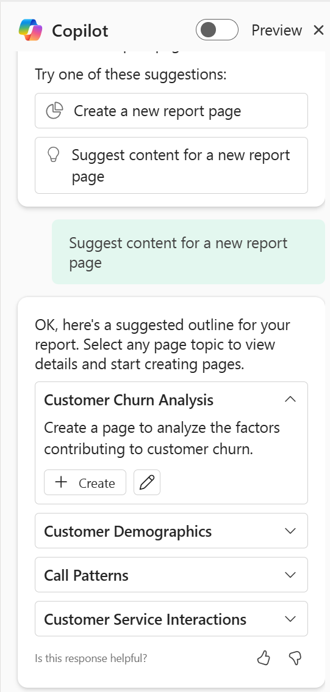

# Get answers from Copilot about data in the model

Copilot doesn't just provide overviews and insights of report content.
With customized requests, copilot tailors its assistance to your
specific needs, guiding you through the exploration process. Whether
you're unsure where to begin or seeking deeper insights, Copilot can
lend a helping hand.

1.  Switch to Power BI Fabric Portal -
    \`https://app.fabric.microsoft.com/home?experience=power-bi\` with
    the credentials provided to you

2.  Select the workspace that you created.

3.  Select **New item.**

4.  Enter \`**Semantic\`** in the **Search** box and select **Semantic
    model** from the list.

5.  Select **Excel** to start building the report

6.  Select **Upload a file** and **Browse**

7.  Navigate to **C:\Lab Files.** Select **Churn.xlsx.** Select **Open**

8.  Select **Sign in** and then **Next.**

9.  Select **Sheet 1** and then **Create.**

10. It takes a minute to create.

11. Select Copilot from the ribbon.

12. Select **Suggest content for a new report page.**

13. Select **Create** for **Customer Retention Analysis**

14. The copilot generates as per the prompt.

Task 2 – Asking questions about the data

1.  Enter “**Create a bulleted list of insights**”. - The copilots
    interprets the prompt and generates the output accordingly.

2.  This gives a clear view of the model that is uploaded.

3.  To understand the visuals about the model, you can enter “
    **Summarize visuals on this page.”**

4.  The copilot generates and provides the summary about the visuals in
    the report.

5.  As per the data that you have uploaded if you ask copilot to provide
    the high customer service calls by age.

> 

6.  Copilot analyses the visual and provides the out put accordingly.

