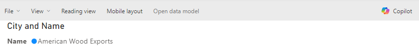
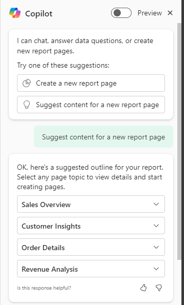
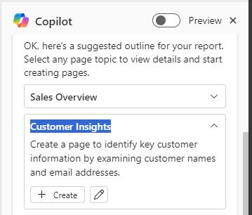
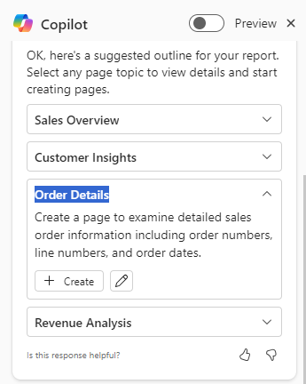
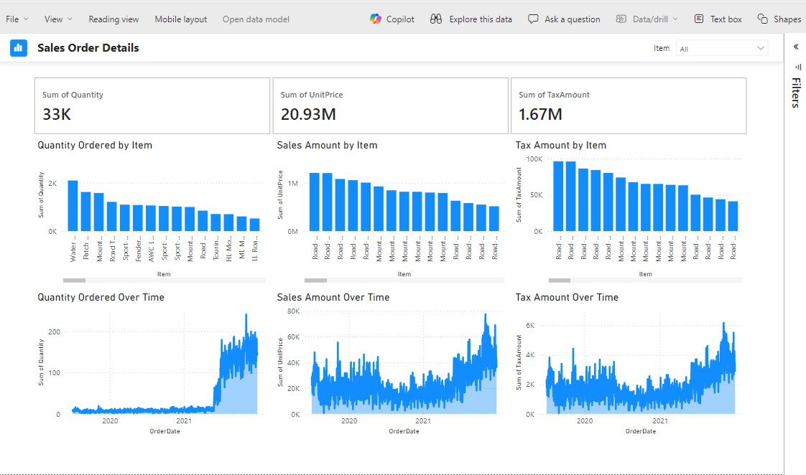
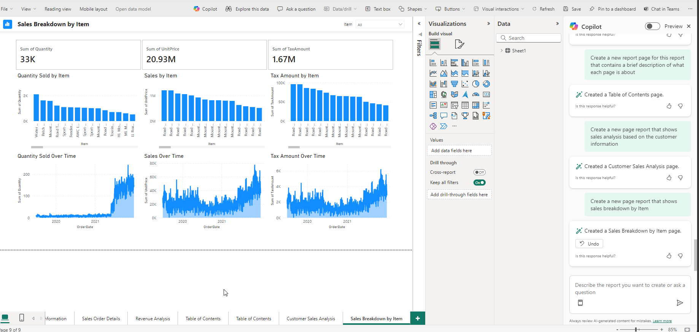

# Lab 4 - Write Copilot prompts for creating report pages in Power BI

**Objective** - In this Lab, you will be writing sample prompts to recedive proper information regarding your model to copilot in Power BI 

## Task 1 – Creating pages for the copilot generated prompts 

1.  Minimize all the tables view under **Data**,Expand **Sales** table in Power BI report page. In the ribbon, select the** Copilot** icon.

    

2.  In the Copilot pane, select **Suggest content for a new report
    page**. Copilot evaluates the data and makes suggestions.

    

3.  On the right side of the page, under copilot pane suggested prompts
    are generated.  Each sample prompt is paired with a report page that
    Copilot generated based on the interpretation of that prompt.

    

4.  **Sales overview** – Select **Create** for this prompt to create the
    page.

    

    

5.  The page is created accordingly.

    

6.  **Customer Insights –** Select **Create**, and the page will be
    created accordingly.

    

    

7.  Order Details – Select **Create.**

    

    

8.  Revenue Analysis – Select **Create.**

    

    

## Task 2 – Creating pages for the custom prompts to copilot

1.  Generating Table of contents. – On the copilot pane, if you enter
    **“Make a table of contents for this report that contains a brief
    description of what each page is about”.** Copilot generates based
    on the interpretation of the prompt.

    

2.  If you want to understand the sales analysis base don customer
    information – You Enter **“Create a new page report that shows sales
    analysis based on the customer information”**

    

3.  We want to generate the sales breakdown with respect to the items.
    We Enter **“Create a new page report that shows sales breakdown by
    Item”.** Copilot generates the report page accordingly.

    

**Summary** - Congratulations!!  You have successfully created prompts and pages with the help of Copilot in Power BI