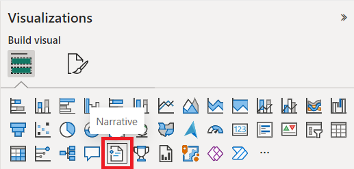
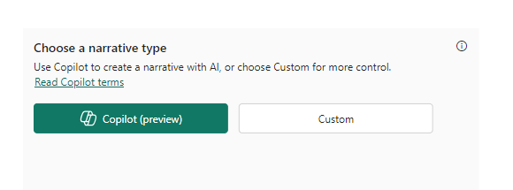
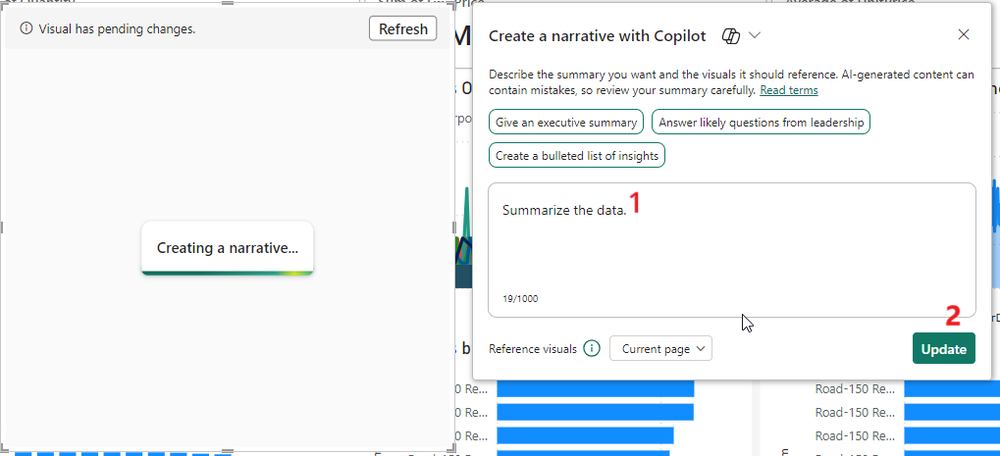
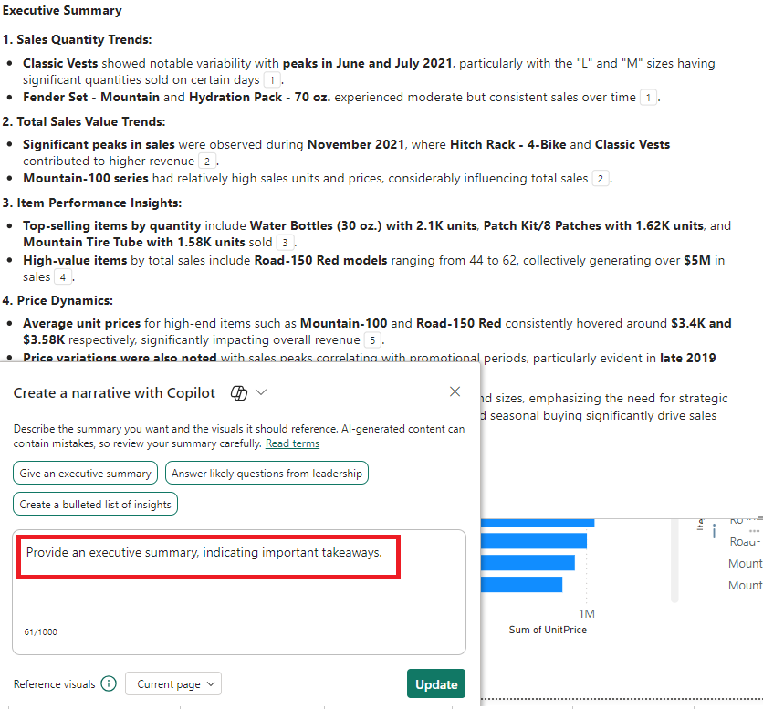
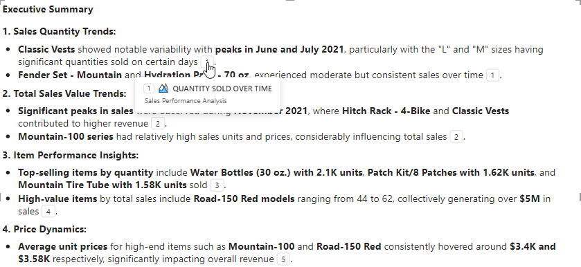
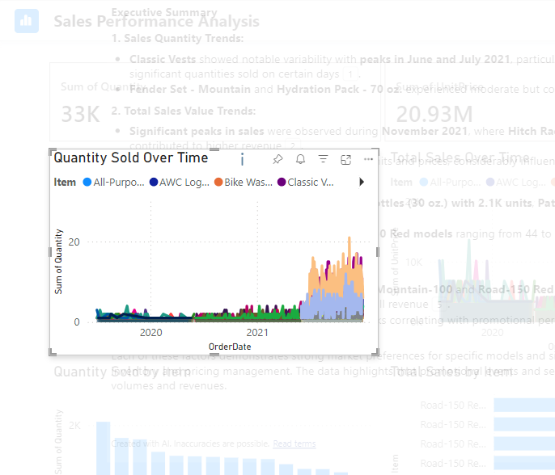

# Creating a narrative with Copilot for Power BI

**Objective** - In this Lab, you will create a Narrative in both Power Bi Service and Descktop

## Task 1 – Creating a Narrative in Power BI service

In the Power BI service, you need to be in an appropriate workspace to
see the Narratives with Copilot visual button in the Visualizations
pane. The Copilot visual button is the same as the old narratives visual
button

1. Currently, you are on the **Sales** report page.

2.  Open a New page in the report.

3.  In the **Visualizations** pane, select the **Narrative** icon.

4.  In **Choose a narrative type**, select the **Copilot** button to use
    the new narrative visual.

5.  Select an option in the **Create a narrative with Copilot** dialog
    and select **Create**.

6.  For this lab, in the dialog box let the **Summarize the data** text
    be as it and click on update for narrative to be generated

7.  It takes approximately 1-2 minutes to generate.

8.  Read through the summary to make sure it's accurate.

9.  To change the narrative, in the **Adjust your summary with
    Copilot**, give instructions to change it, or use one of the
    suggested prompts.

10. Select the footnotes to view references to specific visuals in the
    summary.

11. Power BI highlights the visual that the footnote refers to.

Save the report.

## Task 2 – Creating a Narrative in Power BI Desktop.

1.  Launch the Power BI Desktop app if you have closed it.

2.  Sign in with the credentials provided to execute the labs

3.  Select a **data source \> OneLake data hub**

4.  Select **Vendor List** semantic model and select **Connect**

5.  Create two report pages for the model.

6.  Perform the same steps as you performed for Power BI service.

**Summary** - 
**Objective** - Congratulations!! You have successfully created a Narrative in both Power Bi Service and Descktop