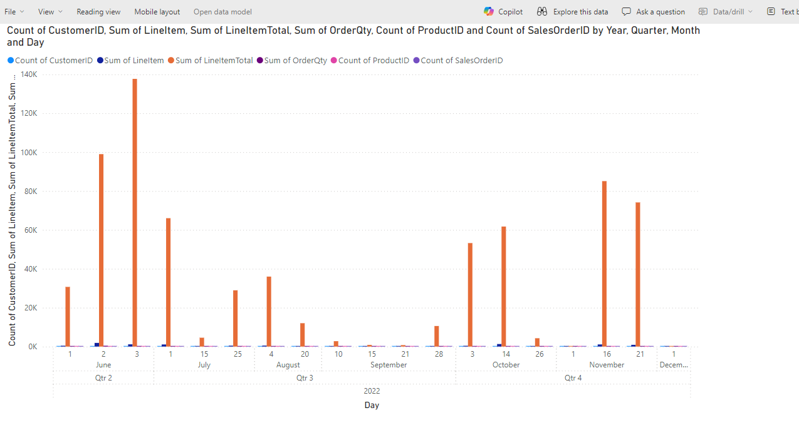

# Lab 6 - Summarize a report in the Copilot pane

**Objective** - In this Lab, You will know how to Summarize a report in the Copilot pane

## Task 1 - Summarize a report in the Copilot pane

1. Open a new page in the power BI report and select **Orders** table.

11. Click on the mouse anywhere else on the page. Select all the columns
    on the right side of the page under **Data** for this table.

12. The visual appears on the left side of the page.

    

13. Click on **Copilot** on the ribbon. Enter “Give me an executive
    summary”.

14. After you choose a prompt, select **Enter** and watch Copilot
    generate your summary.

    

15. You can also ask **Custom prompts.** Enter “ Give me an executive
    summary with bulleted insights of this page”

16. Copilot generates the summary as per the prompt entered

    

17. Copilot allows you to generate a custom summary to fit your business
    needs . When you enter “ Summarize the trends that are shown across
    this report.”

18. The summary is generated as per the prompt.

    

## Task 2 - Delete the Fabric Capacity from Azure Portal

1. Navigate to Azure Portal - <https://portal.azure.com/#home>

2. Select **All resources** under **Navigate**. 

3. Select your **Fabric Capacity** that is visible

4. Select **Delete**

5. Enter the capacity name and Select **Delete** 

6. The Fabric Capacity is deleted.

**Summary** - Congratulations!! You have successfully summarized a report in the Copilot pane
