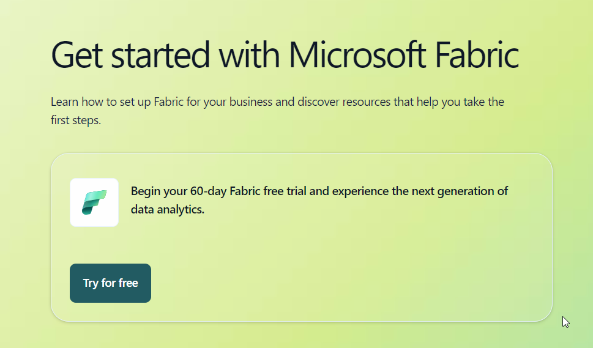
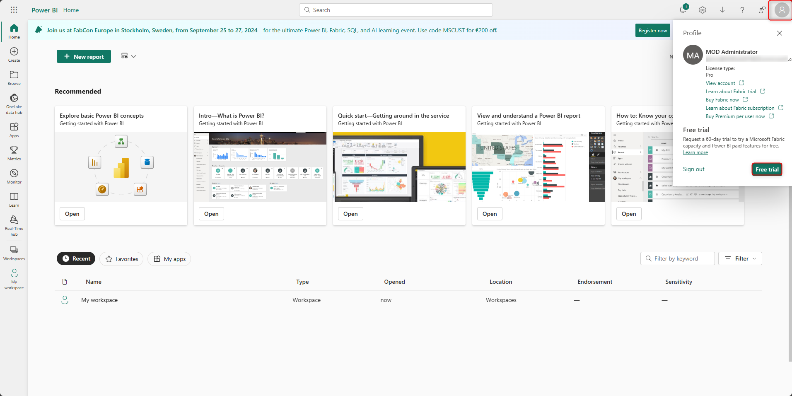

# Summarize a report in the Copilot pane

1.  Switch to Power BI Fabric Portal -
    \`https://app.fabric.microsoft.com/home?experience=power-bi\` with
    the credentials provided to you

2.  Select the workspace that you created.

3.  Select **New item.**

4.  Enter \`**Semantic\`** in the **Search** box and select **Semantic
    model** from the list.

5.  Select **Excel** to start building the report

6.  Select **Upload a file** and **Browse**

7.  Navigate to **C:\Lab Files.** Select **Orders.xlsx.** Select
    **Open**

8.  Select **Sign in** and then **Next.**

9.  Select **Sheet 1** and then **Create.**

10. It takes a minute to create.

11. Click on the mouse anywhere else on the page. Select all the columns
    on the right side of the page under **Data \> Sheet1**

12. The visual appears on the left side of the page.

13. Click on **Copilot** on the ribbon. Enter “Give me an executive
    summary”.

14. After you choose a prompt, select **Enter** and watch Copilot
    generate your summary.

15. You can also ask **Custom prompts.** Enter “ Give me an executive
    summary with bulleted insights of this page”

16. Copilot generates the summary as per the prompt entered

17. Copilot allows you to generate a custom summary to fit your business
    needs . When you enter “ Summarize the trends that are shown across
    this report.”

18. The summary is generated as per the prompt.

