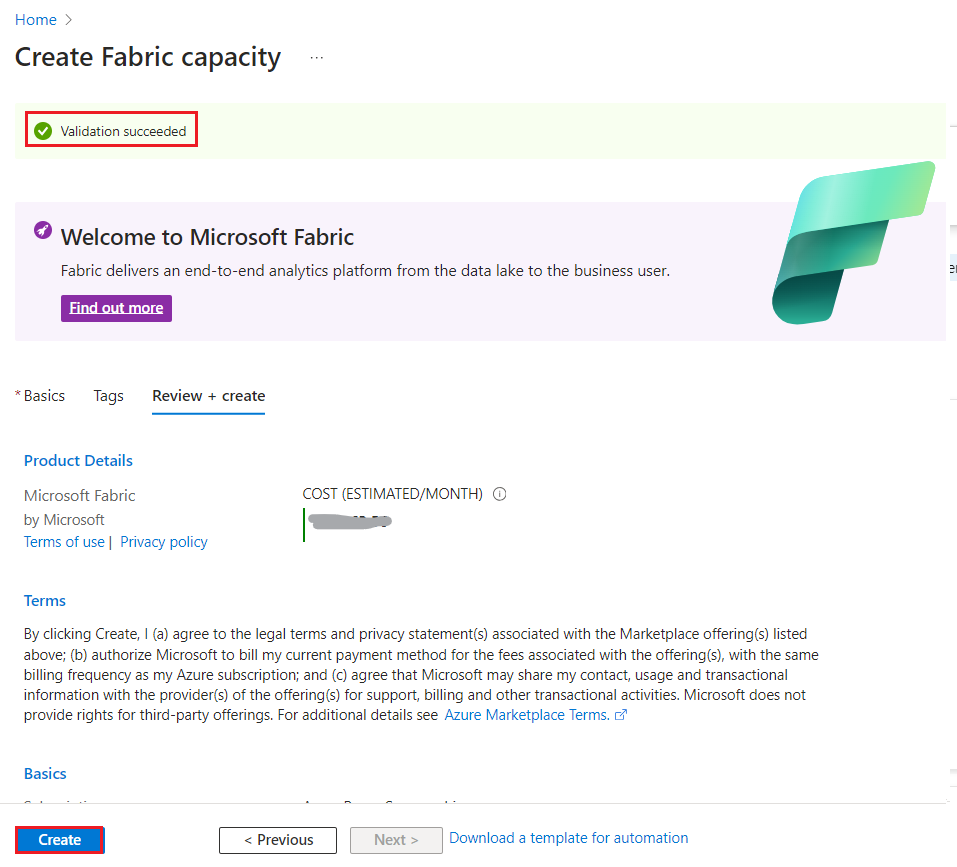
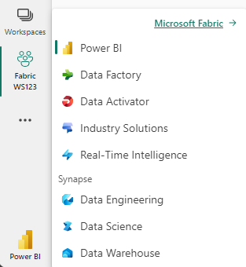
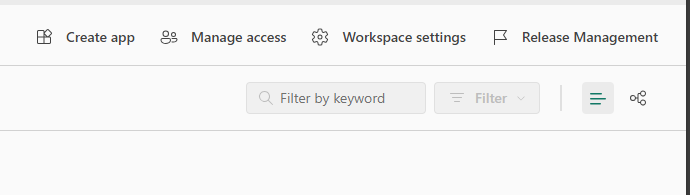
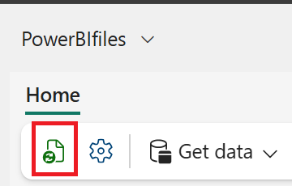

# Write Copilot prompts to create narrative visuals in Power BI

## Task 1 - Generate report using Copilot in Power BI Service

1.  Switch to Power BI Fabric Portal -
    \`https://app.fabric.microsoft.com/home?experience=power-bi\` with
    the credentials provided to you

2.  Select the workspace that you created.

3.  Select **New item.**

4.  Enter \`**Semantic\`** in the **Search** box and select **Semantic
    model** from the list.

5.  Select **Excel** to start building the report

6.  Select **Upload a file** and **Browse**

7.  Navigate to **C:\Lab Files.** Select **Customer Bank Data.xlsx.**
    Select **Open.** The upload is successfully completed.

8.  Select **Sign in** and then **Next.**

9.  Select **Sheet 1** and then **Create.**

10. It takes a minute to create.

11. Click on the mouse anywhere else on the page. Select columns on the
    right side of the page under **Data \> Sheet1**

## Task 2 – Using Copilot for custom prompts for narrative visuals

1.  Select **Copilot** from the ribbon.

2.  Select Suggest content for new report page.

3.  Copilot suggests prompts based on the interpretation.

4.  Create a report for **Customer Age Analysis.**

5.  A report page is created.

6.  Select Narrative under Visualizations.

7.  Select **Copilot(Preview)** on the **Choose the narrative type**
    window.

8.  Using the original suggested prompt. – Select **Give an Executive
    Summary**

9.  Using the first modification of the custom prompt. First, we modify
    the narrative with this custom prompt. Enter - **Shorten this
    summary and bold the key information**

10. Now let’s move to **Second modification: Custom prompt.** This time,
    we again modify the summary by using a different custom prompt.
    Enter - **Make the first bullet point about Average age**

11. Now, let’s perform the **Third modification: Custom prompt.** This
    time, we again modify the summary by using a different custom prompt

    1.  Select the generated prompt – **Answer likely questions from
        leadership**

    2.  Enter - Add the question "What are the factors that influence
        the customer age”

## Task 3 – Create a narrative answer about something specific in your report

1.  Generate a report for Geographical distribution prompt.

2.  The Report is created accordingly to the prompt.

3.  Open the **Narrative** from the **Visualizations** again. Then
    select **Copilot(preview)**

4.  Let us create a narrative answer investigating something specific in
    your report

5.  Enter - Generate a summary explaining the relationship between
    Average spend by Zipcode and Customer since.

6.  The copilot generates output narrative accordingly.
