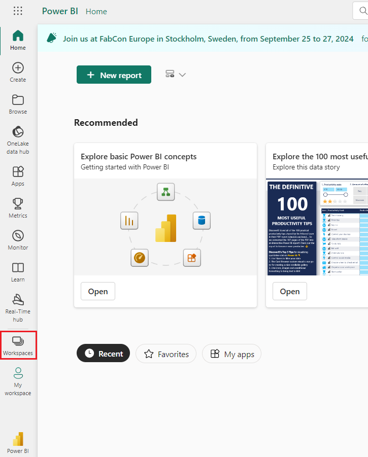
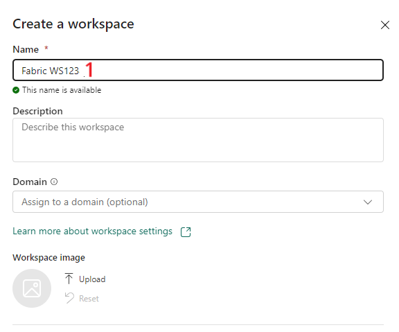
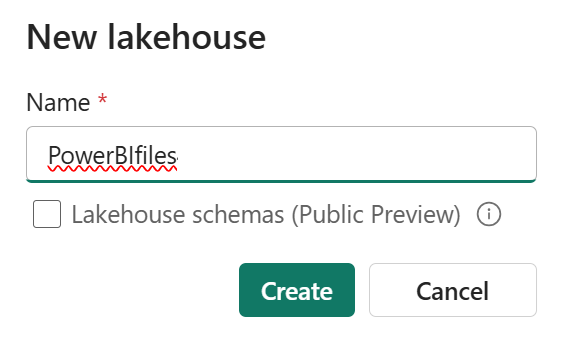
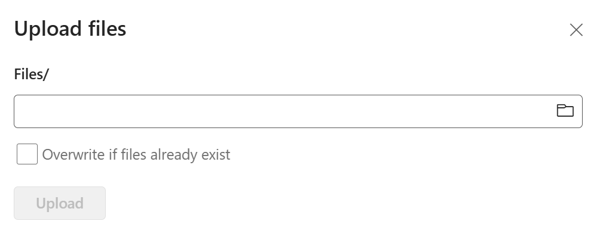
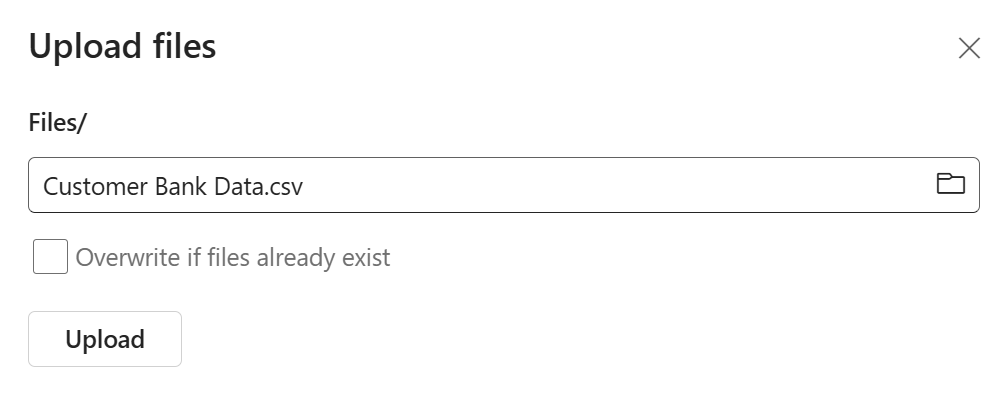

# Lab 7 - Write Copilot prompts to create narrative visuals in Power BI

**Objective** - In this Lab, You will create few prompts to Copilot to create Narrative

## Task 1 - Create Fabric Capacity using Azure portal

Microsoft Fabric is deployed to an Azure Active Directory tenant. Within
each Fabric tenant, Fabric capacities can be created to group resources
for various purposes -- this might be done organizationally (sales,
marketing, development), geographically, or other logical grouping.

If a Fabric Trial is available, we recommend taking advantage of that
opportunity to try Microsoft Fabric for a period of time (currently 60
days) with no commitment. To see if you are in a trial or eligible for a
trial, visit the [Fabric portal](https://app.fabric.microsoft.com/). If
you are able to log in or presented the option to start a trial, you
should be all set!

To create a Fabric capacity outside of a trial environment, create a new
resource from the Azure portal, and search for Fabric.

1.  Open a new tab in the browser. Login to Azure Portal – <https://portal.azure.com> with the
    credentials provided to you to execute the lab.

2.  From the Azure portal home page, click on **Azure portal menu**
    represented by three horizontal bars on the left side of the
    Microsoft Azure command bar as shown in the below image.

    

3.  Navigate and click on **+ Create a resource**.

    

4.  On **Create a resource** page, in the **Search services and
    marketplace** search bar, type!!**Fabric!!**, then select
    **Microsoft fabric**.

    

5.  In the **Marketplace** page, navigate to the **Microsoft Fabric**
    section, click on the **Create** button dropdown, then select
    **Microsoft Fabric** as shown in the image.

    

6.  In the **Create Fabric capacity** window, under the **Basics** tab,
    enter the following details and click on the **Review+create**
    button.

    1. **Subscription** - Select the assigned subscription

    2. **Resource group**	Click on **Create new** enter ``FabricXXX`` (XXX can be a unique number, you can add more digits after XXX to make the name unique)

    3. **Capacity name** - !!fabricXXX!!( XXX can be a unique number, you can add more digits after XXX to make the name unique)

    4. **Region** - Select near by available region, in this lab **West US 3** is using for this resource

    5. **Size**	 -  F64 SKU 

        

    

7.  Once the Validation is succeeded, click on the **Create** button.

    

8.  After the deployment is completed, click on the **Go to resource**
    button.

    

## Task 2 - Create a Fabric Workspace

1.  Switch back to Fabric Home page.

2.  Go back to **Power BI** window. Select Power BI from the left bottom
    navigation pane.

    

3.  On the left side navigation menu of **Power BI** Home page, navigate
    and click on **Workspaces**.

    

4.  In the Workspaces pane, click on **+** **New workspace button.**

    

5.  In the **Create a workspace** pane that appears on the right side,
    enter the following details, and click on the **Apply** button.

    1. **Name** - `Fabric WSXXX` (XXX can be a unique number) 

    2. **Advanced**	- Under **License mode**, select **Fabric** 

    3. **Default storage format** - Small semantic dataset storage format

    4. **Capacity** - FabricXXX-West US3

    5. **Template apps**	 -  Check the Develop template apps

    

    

6.  Wait for the deployment to complete. It takes 2-3 minutes to
    complete.

    

7.  Select **Workspace settings.**

    

8.  Select **License info** and check that workspace is created under
    **Fabric Capacity**

    

## Task 3 – Import Files to Lakehouse in Fabric

1.	Navigate back to Power BI Service in Microsoft Fabric Portal. Select your workspace.

2.	Select **New Item**

    
 
3.	Search for **Lakehouse** and select the correct option from the list under **Store data**

    
 
4.	Enter the name of the Lakhouse as – `PowerBIFiles`. Select **Create**

    
 
5.	Expand **Get data > Upload files**

    
 
6.	Select Browse icon. 

    
 
7.	Navigate to **C:\Labfiles**. Select the **Customer Bank Data.CSV** file and select upload. Close the window once the file is uploaded.

    
 
8.	Refresh the Lakehouse page for the files to visible.

    
 
9.	The file is visible now.

10.	Select three horizontal dots for the **Customer Bank data.csv** file. Select Load to **Tables> New Table**

    
 
11.	 Give a proper name for the table and select **Load**.

    
 
12.	It will take some time to load

13.	 You will see the table is created.

    
 

## Task 4 - Generate report using Copilot in Power BI Service

1.  Select Customer Bank Data table

2.	Select the drop-down under **Lakehouse** on the top right corner of the page. Select **SQL analytics endpoint**

    
 
3.	Select **Reporting** tab. Select New report.

    
 
4.	It will navigate you to Power BI report page.

5.	Select the **Table** visualization. Select all the columns.

## Task 5 – Using Copilot for custom prompts for narrative visuals

1.  Select **Copilot** from the ribbon.

    

2.  Select Suggest content for new report page.

    

3.  Copilot suggests prompts based on the interpretation.

    

4.  Create a report for **Customer Age Analysis.**

    

    

5.  A report page is created.

    

6.  Select Narrative under Visualizations.

    

7.  Select **Copilot(Preview)** on the **Choose the narrative type**
    window.

8.  Using the original suggested prompt. – Select **Give an Executive
    Summary**

    

9.  Using the first modification of the custom prompt. First, we modify
    the narrative with this custom prompt. Enter - **Shorten this
    summary and bold the key information**

    

10. Now let’s move to **Second modification: Custom prompt.** This time,
    we again modify the summary by using a different custom prompt.
    Enter - **Make the first bullet point about Average age**

    

11. Now, let’s perform the **Third modification: Custom prompt.** This
    time, we again modify the summary by using a different custom prompt

    1.  Select the generated prompt – **Answer likely questions from
        leadership**

    2.  Enter - Add the question "What are the factors that influence
        the customer age”

    

## Task 5 – Create a narrative answer about something specific in your report

1.  Generate a report for Geographical distribution prompt.

    

2.  The Report is created accordingly to the prompt.

    

3.  Open the **Narrative** from the **Visualizations** again. Then
    select **Copilot(preview)**

4.  Let us create a narrative answer investigating something specific in
    your report

5.  Enter - Generate a summary explaining the relationship between
    Average spend by Zipcode and Customer since.

    

6.  The copilot generates output narrative accordingly.

**Summary** - Congratulations!! You have successfully created prompts to Copilot to create Narrative
