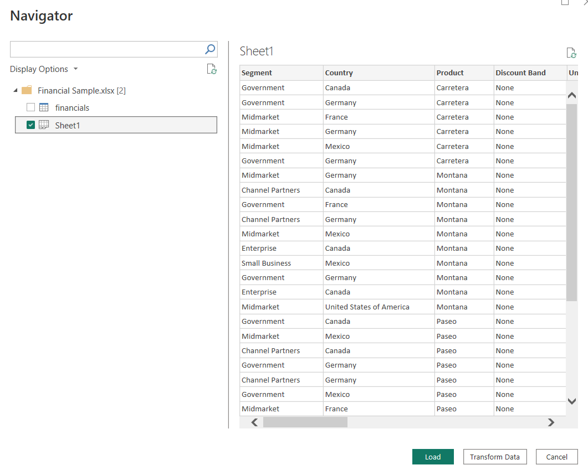
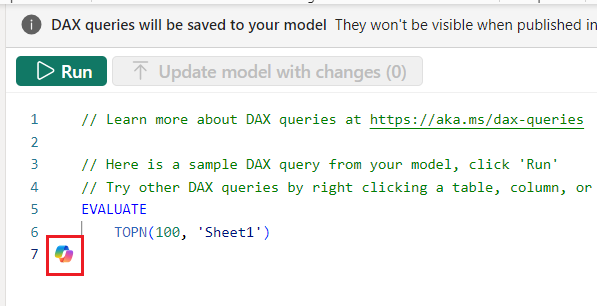

# Lab 8 - Write and explain DAX queries using Copilot

**Objective** - In this Lab, you will know about how to write DAX queries using Copilot in Power BI desktop

## Task 1 – Import a report in Power BI Desktop

1.  Launch the **Power BI Desktop** app on the Desktop

2.  Sign in if you are not signed in with the credentials provided you
    to execute the lab

3.  Select **Blank Report**

    

4.  Select **Get Data \> Excel workbook** and navigate to
    **C:\LabFiles.** Select **Financial Sample.xlsx** file.

    

5.  Select **Sheet 1 \> Load.**

    

6.  The data is loaded. Select all the columns on the right-hand side of
    the page under **Data \> Sheet 1**

    

## Task 2 – Run the DAX Query 

1.  Select **Dax Query View** on the left navigation pane.

    

2.  You will see DAX query window with existing query as shown in the
    screenshot below. Select **Run**

    

3.  When you run the query, it displays the first 100 rows and columns
    along with its value

    

4.  Select Copilot button visible at the bottom of the query.

    

5.  Now, let us give a prompt to copilot to display the first two
    columns. Hence you enter the DAX query conversationally. – **List
    the first two columns.**

    

6.  The copilot adjusts the query accordingly. Select **Run**.

    

7.  The output is displayed accordingly.

8.  You can Run the DAX query then decide to Keep or Discard the DAX
    query.

    

## Task 3 - Explaining what this query does

1.  Enter – **List three columns** again and run the query.

2.  Select **Explain this query.**

3.  Copilot returns the answer to what exactly the query displays the
    data.

    

4.  Select Show more to see the full explanation so that we understand
    each part and the DAX functions used.

    

## Task 4 – Asking query related to DAX queries.

1.  Enter **SUMMARIZECOLUMNS** in the query box and hit enter.  

2.  Again, Copilot generates brief description

3.  Select **Show more**.

    

4.  Because we asked Copilot in the context of a DAX query , it gives
    the response in the context of that query.

Note – You can use several DAX queries available for your report – [DAX
Queries](https://learn.microsoft.com/en-us/dax/average-function-dax)

**Summary** - Congratulations!! You have successfully written DAX queries using Copilot in Power BI desktop
