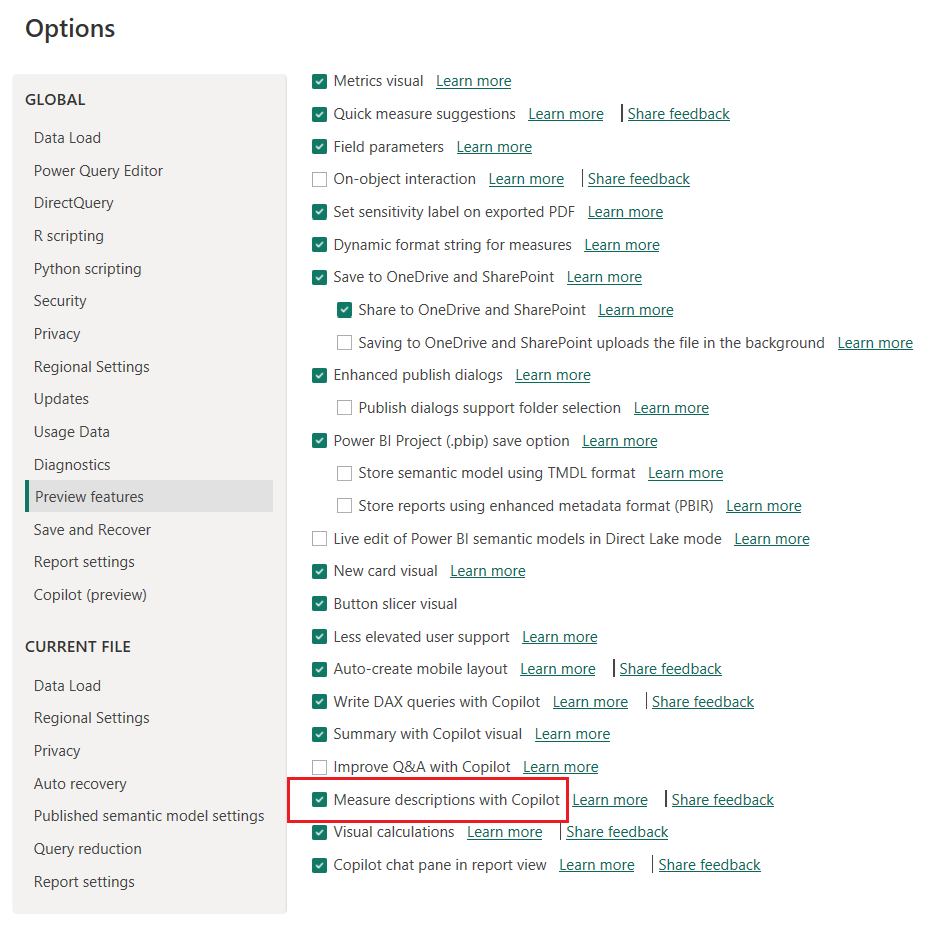
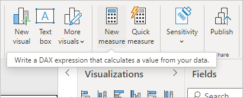
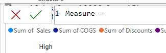
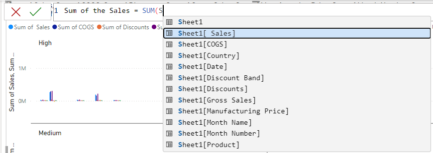
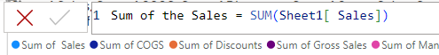
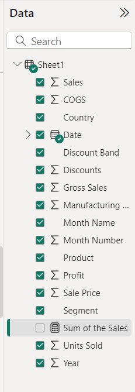
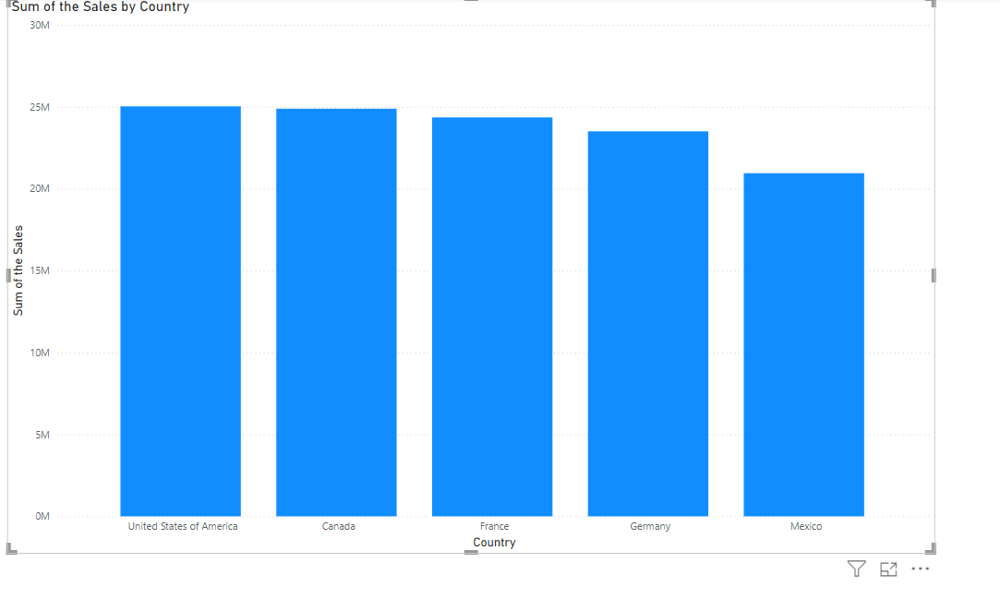
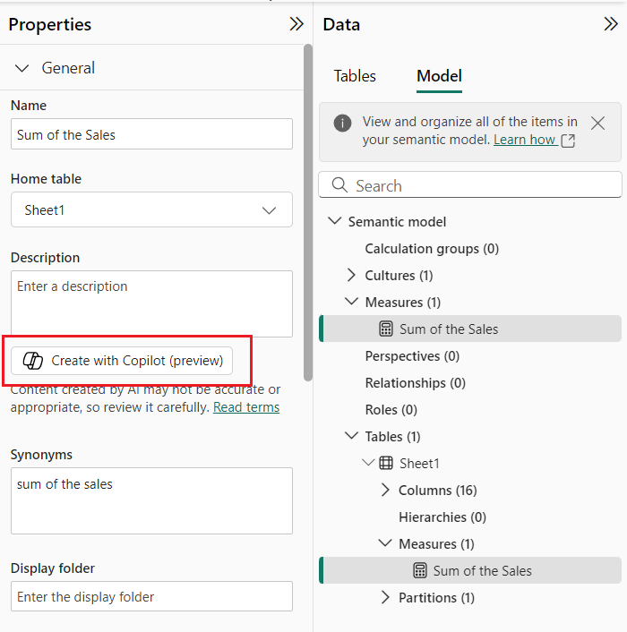
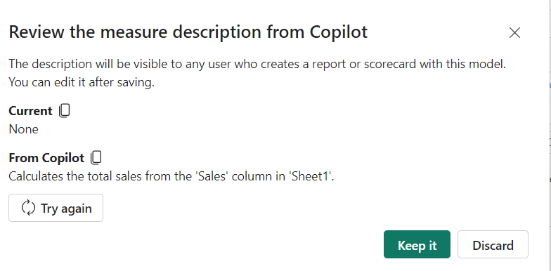
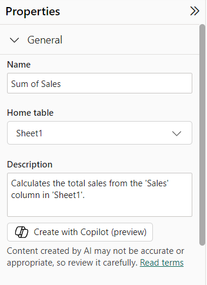

# Use Copilot to create measure descriptions

## Task 1 - Enable the preview feature

1.  Launch the Power BI Desktop that is available on the desktop.

2.  Navigate to **File** \> **Options and settings** \> **Options**.

3.  Select **Preview features**, select **Measure descriptions with
    Copilot**.

4.  Check if the option is enabled, if it is not, check the option and
    select **OK.**

## Task 2 – Create a new Measure

1.  In the **Fields** pane on the right side of the page, right-click
    the **Sheet1** table, or hover over the table and select **More
    options** (**...**).

2.  From the menu that appears, choose **New measure**.

> 

3.  This action saves your new measure in the **Sheet1** table, where
    it's easy to find.

4.  You can also create a new measure by selecting **New Measure** in
    the **Calculations** group on the **Home** tab of the Power BI
    Desktop ribbon.

> 

**Tip -** When you create a measure from the ribbon, you can create it
in any of your tables, but it's easier to find if you create it where
you plan to use it. In this case, select the **Sheet 1** table first to
make it active, and then choose **New measure**.

5.  The formula bar appears along the top of the report canvas, where
    you can rename your measure and enter a DAX formula.

6.  By default, each new measure is named *Measure*. If you don’t rename
    it, new measures are named *Measure 2*, *Measure 3*, and so on.
    Because we want this measure to be more identifiable,
    highlight *Measure* in the formula bar, and then change it to **Sum
    of Sales**.

7.  Begin entering your formula. After the equals sign, start to
    type *Sum*. As you type, a drop-down suggestion list appears,
    showing all the DAX functions, beginning with the letters you type.
    Scroll down, if necessary, to select **SUM** from the list, and then
    press **Enter**.

8.  An opening parenthesis appears, along with a drop-down suggestion
    list of the available columns you can pass to the SUM function.

9.  Expressions always appear between opening and closing parentheses.
    For this example, your expression contains a single argument to pass
    to the SUM function: the **Sales** column.

10. Begin typing ***Sheet 1***.

11. The column name preceded by the table name is called the fully
    qualified name of the column. Fully qualified column names make your
    formulas easier to read.

12. Select **Sheet 1\[Sales\]** from the list, and then enter a closing
    parenthesis.

**Tip -** Syntax errors are most often caused by a missing or misplaced
closing parenthesis.

13. The measure is created.

14. Now uncheck all the columns except **Country** and **Sum of Sales**

15. The chart now uses one measure that you created manually **Sum of
    Sales** and Country which Power BI summed automatically.

## Task 3 – Create a measure description

1.  In the existing model , we select manually created measure in the
    Data pane of Model view to see the measure properties.

2.  Select Model view from the left navigation pane

> 

3.  Select **Model** tab and then manually created measure – **Sum of
    Sales.**

4.  Select the **Create with Copilot** (preview) button under
    the **Description** textbox.

5.  Review the measure description from Copilot, then select **Keep
    it**.

6.  Now the measure description is in the **Description** box. You can
    edit the description, if you need to.

